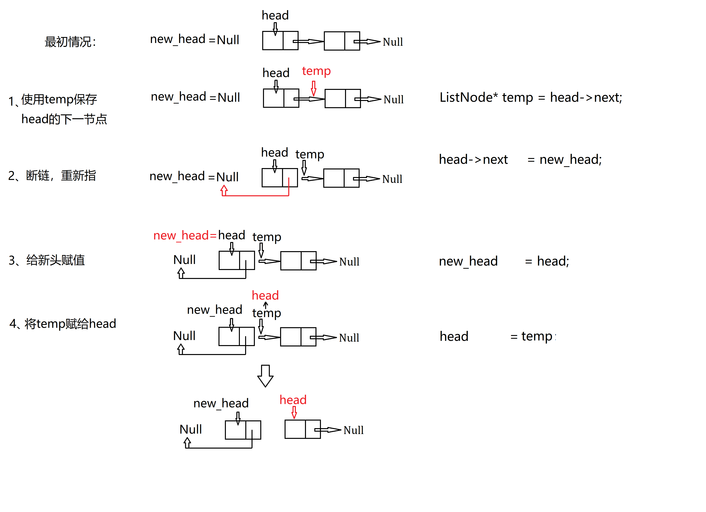

# 数据结构与算法实践

## 一、数组、链表
#### 1. [反转链表 206. Reverse Linked List](src/oj/206_reverse_linked_list/reverse_linked_list.cpp)----[题目来源](https://leetcode.com/problems/reverse-linked-list/)
#### 2. [局部反转链表 92. Reverse Linked List II](src/oj/92_reverse_linked_list_II/reverse_linked_list_II.cpp)----[题目来源](https://leetcode.com/problems/reverse-linked-list-ii/)
#### 3. [求两个链表的交点 160. Intersection of Two Linked Lists](src/oj/160_get_intersection_node/getIntersectionNode.cpp)----[题目来源](https://leetcode.com/problems/intersection-of-two-linked-lists/description/)
#### 4. [链表求环 142. Linked List Cycle II](src/oj/142_detectCycle/detectCycle.cpp)----[题目来源](https://leetcode.com/problems/linked-list-cycle-ii/)
#### 5. [链表划分 86. Partition List](src/oj/86_partition_list/partition_list.cpp)----[题目来源](https://leetcode.com/problems/partition-list/description/)
#### 6. [带有随机指针链表的深度拷贝 138. Copy List with Random Pointer](src/oj/138_copyRandomList/copyRandomList.cpp)----[题目来源](https://leetcode.com/problems/copy-list-with-random-pointer/description/)
#### 7. [两个已排序链表的合并 21. Merge Two Sorted Lists](src/oj/21_mergeTwoLists/mergeTwoLists.cpp)----[题目来源](https://leetcode.com/problems/merge-two-sorted-lists/description/)
#### 8. [K个已排序链表的合并 23. Merge k Sorted Lists](src/oj/23_mergeKLists/mergeKLists.cpp)----[题目来源](https://leetcode.com/problems/merge-k-sorted-lists/description/)
#### 9. [剑指 Offer 03 找出数组中重复的数字](src/oj/offer03_findRepeatNumber/findRepeatNumber.cpp)

## 二、栈、队列、堆
#### 1. [使用队列实现栈 225. Implement Stack using Queues](src/oj/225_make_stack_with_queue/stack_use_queue.cpp)----[题目来源](https://leetcode.com/problems/implement-stack-using-queues/description/)
#### 2. [简单计算器 224. Basic Calculator](src/oj/224_basicCalculator/basic_calculator.cpp)----[题目来源](https://leetcode.com/problems/basic-calculator/description/)
#### 3. [第K大个数 215. Kth Largest Element in an Array](src/oj/215_Kth_largest_num/kth_largest_num.cpp)----[题目来源](https://leetcode.com/problems/kth-largest-element-in-an-array/description/)
#### 4. [寻找中位数 295. Find Median from Data Stream](src/oj/295_find_median/find_median.cpp)----[题目来源](https://leetcode.com/problems/find-median-from-data-stream/description/)
#### 5. [使用栈实现队列 232. Implement Queues using Stack](src/oj/232_make_queue_using_stacks/queue_use_stack.cpp)----[题目来源](https://leetcode.com/problems/implement-queue-using-stacks/description/)
#### 6. [最小栈 155. Min Stack](src/oj/155_min_stack/min_stack.cpp)----[题目来源](https://leetcode.com/problems/min-stack/description/)

## 三、贪心算法
#### 1. [分糖果 455. Assign Cookies](src/oj/455_assign_cookies/assign_cookies.cpp)----[题目来源](https://leetcode.com/problems/assign-cookies/description/)
#### 2. [最长摇摆子序列 376. Wiggle Subsequence](src/oj/376_wiggle_subsequence/wiggle_subsequence.cpp)----[题目来源](https://leetcode.com/problems/wiggle-subsequence/description/)
#### 3. [删除K个数获得最小数 402. Remove K Digits](src/oj/402_remove_k_digits/remove_k_dig.cpp)----[题目来源](https://leetcode.com/problems/remove-k-digits/)
#### 4. [跳跃游戏I 55. Jump Game](src/oj/55_jump_game/jump_game.cpp)----[题目来源](https://leetcode.com/problems/jump-game/description/)
#### 5. [跳跃游戏II 45. Jump GameII](src/oj/45_jump_game_II/jump_game_II.cpp)----[题目来源](https://leetcode.com/problems/jump-game-ii/submissions/)
#### 6. [射击气球 452. Minimum Number of Arrows to Burst Balloons](src/oj/452_burst_balloons/burst_balloons.cpp)----[题目来源](https://leetcode.com/problems/minimum-number-of-arrows-to-burst-balloons/)

## 四、递归、分治、回溯

| 序号 | 知识点 | 题目 | 题源 | 难度 | 解决状态 |
|:----:|:-----|------|:----:|:----:|:----:|
|   1  |回溯，位运算|   [非重复元素数组所有子集](src/oj/78_subsets/subsets.cpp)   | L78 | 中等 | √
|   2  |回溯        |   [有重复元素数组所有子集](src/oj/90_subsets_II/subsets_II.cpp)    |   L90   |  中等 | √
|   3  |回溯，剪枝  |   [找出数组中和为目标值的组合](src/oj/40_combination_sum_II/combination_sum_II.cpp)   |   L40    |  中等 | √
|   4  |回溯        |   [N皇后问题](src/oj/51_N_queens/n_queens.cpp)   |   L51    |  困难 | √
|   5  |递归        |   [生成所有括号](src/oj/22_generate_parentheses/generate_parentheses.cpp)   |   L22    |  中等 | √
|   6  |分治，递归  |   [逆序数，计算右侧小于当前元素的个数](src/oj/315_count_smaller_numbers/count_smaller_numbers.cpp)   |   L315    |  困难 | √
|   7  |递归        |   [从尾到头打印链表](src/oj/offer06_reversePrint/reversePrint.cpp)   |   O6    |  简单 | √
|   8  |回溯        |   [矩阵中的路径](src/oj/offer12_exist/exist.cpp)   |   O12    |  中等 | √

## 五、二叉树与图
#### 1. [路径之和 113. Path Sum II](src/oj/113_path_sum_II/path_sum_II.cpp)----[题目来源](https://leetcode.com/problems/path-sum-ii/)
#### 2. [最近公共祖先 236. Lowest Common Ancestor of a Binary Tree](src/oj/236_lowest_commonance_ancestor/lowest_commonance_ancestor.cpp)----[题目来源](https://leetcode.com/problems/lowest-common-ancestor-of-a-binary-tree/)
#### 3. [二叉树就地转链表 114. Flatten Binary Tree to Linked List](src/oj/114_flatten_binary_tree2linked_list/flatten_binary_tree2linked_list.cpp)----[题目来源](https://leetcode.com/problems/flatten-binary-tree-to-linked-list/description/)
#### 4. [二叉树层次遍历 广度优先  breadth-first search](src/ds_basic_knowledge/binary_tree_breadth_first_search/binary_tree_breadth_first_search.cpp)
#### 5. [从右侧观察二叉树 199. Binary Tree Right Side View](src/oj/199_binary_tree_right_side_view/binary_tree_right_side_view.cpp:15)----[题目来源](https://leetcode.com/problems/binary-tree-right-side-view/)
#### 6. [图的深度优先和广度优先搜索](src/ds_basic_knowledge/graph_depth_first_search/graph_depth_first_search.cpp)
#### 7. [课程安排 207. Course Schedule](src/oj/207_course_schedule/course_schedule.cpp)----[题目来源](https://leetcode.com/problems/course-schedule/) 深搜和广搜两种方法，深搜因为空间限制无法AC，需改进
#### 8. [104. 二叉树的最大深度](src/oj/104_maxDepth/maxDepth.cpp)----[题目来源](https://leetcode-cn.com/problems/maximum-depth-of-binary-tree/)

## 六、二分查找与二叉查找树
#### 1. [二分查找(递归与循环)](src/ds_basic_knowledge/binary_search/binary_search.cpp)!!!(while(begin <= end),等号很重要，考察点)
#### 2. [插入位置 35. Search Insert Position](src/oj/35_search_insert_position/search_insert_position.cpp)----[题目来源](https://leetcode.com/problems/search-insert-position/)
#### 3. [区间查找 34. Find First and Last Position of Element in Sorted Array](src/oj/34_search_range/search_range.cpp)----[题目来源](https://leetcode.com/problems/find-first-and-last-position-of-element-in-sorted-array/)
#### 4. [旋转数组查找 33. Search in Rotated Sorted Array](src/oj/33_search_rotated_sorted_array/search_rotated_sorted_array.cpp)
#### 5. [二叉查找树编码与解码 449. Serialize and Deserialize BST](src/oj/449_serialize_deserialize_BST/serialize_deserialize_BST.cpp)----[题目来源](https://leetcode.com/problems/serialize-and-deserialize-bst/description/)
#### 6. [排序矩阵查找 Of04](src/oj/offer04_searchMatrix/searchMatrix.cpp)
#### 7. [寻找波峰元素 L162](src/oj/162_find_peak/find_peak.cpp)

## 七、哈希表与字符串
#### 1. [拉链哈希函数](src/ds_basic_knowledge/hash/hash.cpp)
#### 2. [409. 最长回文串](src/oj/409_longest_palindrome/longest_palindrome.cpp)----[题目来源](https://leetcode-cn.com/problems/longest-palindrome/)
#### 3. [290. 单词规律](src/oj/290_word_pattern/word_pattern.cpp)----[题目来源](https://leetcode-cn.com/problems/word-pattern/)
#### 4. [49. 字母异位词分组](src/oj/49_group_anagrams/group_anagrams.cpp)----[题目来源](https://leetcode-cn.com/problems/group-anagrams/)
#### 5. [3. 无重复字符的最长子串](src/oj/3_length_longest_substring/length_longest_substring.cpp)----[题目来源](https://leetcode-cn.com/problems/longest-substring-without-repeating-characters/)
#### 6. [76. 最小覆盖子串](src/oj/76_min_window/min_window.cpp)----[题目来源](https://leetcode-cn.com/problems/minimum-window-substring/submissions/) 此题做了两次，第一次是没理解题意，以为目标中没有重复字母，第二次是使用滑窗，但是用了std::map，插入删除的时间复杂度较高，是O(nlgn)而不是O(n),时间超时了。
#### 7. [1. 两数之和](src/oj/1_two_sum/two_sum.cpp)----[题目来源](https://leetcode-cn.com/problems/two-sum/)
#### 8. [队列转多叉树](src/oj/0_listToTree/listToTree.cpp)
#### 9. [剑指 Offer 05. 替换空格](src/oj/offer05_replaceSpace/replaceSpace.cpp)

## 八、搜索
| 序号 | 知识点 | 题目 | 题源 | 难度 | 解决状态 |
|:----:|:-----|------|:----:|:----:|:----:|
|   1  | |   [二叉树的深度优先搜索](src/ds_basic_knowledge/binary_tree_breadth_first_search/binary_tree_breadth_first_search.cpp)   |  | 基础知识| √
|   2  | |   [图的深度，广度优先搜索](src/ds_basic_knowledge/graph_depth_first_search/graph_depth_first_search.cpp)   |  | 基础知识| √
|   3  | |   [A星搜索](src/ds_basic_knowledge/astar/astar.cpp)   |  | 基础知识| √
|   4  |深搜，广搜 |   [岛屿数量](src/ds_basic_knowledge/astar/astar.cpp)   |  | L200| √

## 九、动态规划
| 序号 | 知识点 | 题目 | 题源 | 难度 | 解决状态 |
|:----:|:-----|------|:----:|:----:|:----:|
|   1  |动态规划|   [01背包问题](src/ds_basic_knowledge/0_1_knapsack/knapsack.cpp)   |  | 基础知识| √
|   2  |动态规划|   [爬楼梯](src/oj/70_climbStairs/climbStairs.cpp)    |   L70   |  简单| √
|   3  |动态规划|   [斐波那契数列](src/oj/70_climbStairs/climbStairs.cpp)   |   O10    |  简单| √
|   4  |动态规划|   [青蛙跳台阶](src/oj/70_climbStairs/climbStairs.cpp)   |   O10    |  简单| √
|   5  |动态规划|   [打家劫舍](src/oj/198_rob/rob.cpp)   |   L198    |  简单| √
|   6  |动态规划|   [购物单](src/oj/nhj16_get/get_things.cpp)   |   NH16    |  中等| 40%通过

## 十、排序算法

#### 1. [冒泡排序](src/oj/70_climbStairs/climbStairs.cpp)
#### 2. [插入排序](src/ds_basic_knowledge/sort/sort.cpp)
#### 3. [选择排序](src/oj/70_climbStairs/climbStairs.cpp)
#### 4. [快速排序](src/ds_basic_knowledge/sort/sort.cpp)
#### 5. [归并排序](src/oj/70_climbStairs/climbStairs.cpp)

# 图解
#### 1. [反转链表 206. Reverse Linked List](src/oj/206_reverse_linked_list/reverse_linked_list.cpp)----[题目来源](https://leetcode.com/problems/reverse-linked-list/)

