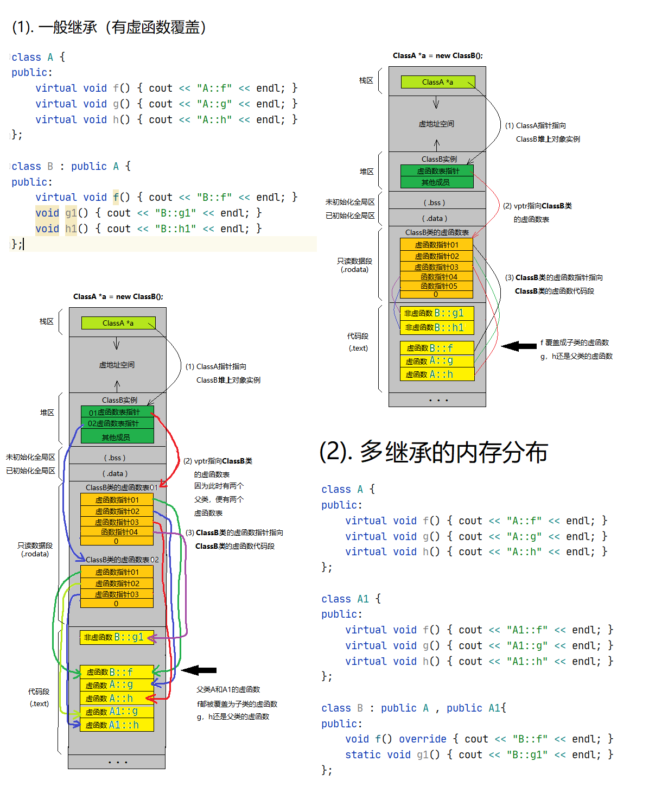

# 一、数据结构与算法实践

## 一、数组、链表
| 序号 | 知识点 | 题目 | 题源 | 难度 | 解决状态 |
|:----:|:-----|------|:----:|:----:|:----:|
|   1  |链表|   [反转链表](src/oj/206_reverse_linked_list/reverse_linked_list.cpp)   | L206 | 简单 | √
|   2  |链表|   [局部反转链表](src/oj/92_reverse_linked_list_II/reverse_linked_list_II.cpp)    |   L92   |  中等 | √
|   3  |链表|   [求两个链表的交点](src/oj/160_get_intersection_node/getIntersectionNode.cpp)   |   L160    |  简单 | √
|   4  |链表|   [链表求环](src/oj/142_detectCycle/detectCycle.cpp)   |   L142    |  中等 | √
|   5  |链表|   [链表划分](src/oj/86_partition_list/partition_list.cpp)   |   L86    |  中等 | √
|   6  |链表|   [带有随机指针链表的深度拷贝](src/oj/138_copyRandomList/copyRandomList.cpp)   |   L138    |  中等 | √
|   7  |链表|   [两个已排序链表的合并](src/oj/21_mergeTwoLists/mergeTwoLists.cpp)   |   L21    |  简单 | √
|   8  |链表|   [K个已排序链表的合并](src/oj/23_mergeKLists/mergeKLists.cpp)   |   L23    |  困难 | √
|   9  |数组|   [找出数组中重复的数字](src/oj/offer03_findRepeatNumber/findRepeatNumber.cpp)   |   O3    |  简单 | √

## 二、栈、队列、堆
| 序号 | 知识点 | 题目 | 题源 | 难度 | 解决状态 |
|:----:|:-----|------|:----:|:----:|:----:|
|   1  |队列|   [使用队列实现栈](src/oj/225_make_stack_with_queue/stack_use_queue.cpp)   | L225 | 简单 | √
|   2  |栈|   [使用栈实现队列](src/oj/232_make_queue_using_stacks/queue_use_stack.cpp)    |   L232   |  简单 | √
|   3  |队列|   [简单计算器](src/oj/224_basicCalculator/basic_calculator.cpp)   |   L224    |  困难 | √
|   4  |堆|   [第K大个数](src/oj/215_Kth_largest_num/kth_largest_num.cpp)   |   L215    |  中等 | √
|   5  |堆|   [寻找中位数](src/oj/295_find_median/find_median.cpp)   |   L295    |  困难 | √
|   6  |栈|   [最小栈](src/oj/155_min_stack/min_stack.cpp)   |   L155    |  中等 | √

## 三、贪心算法
| 序号 | 知识点 | 题目 | 题源 | 难度 | 解决状态 |
|:----:|:-----|------|:----:|:----:|:----:|
|   1  |链表|   [分糖果](src/oj/455_assign_cookies/assign_cookies.cpp)   | L455 | 简单 | √
|   2  |链表|   [最长摇摆子序列](src/oj/376_wiggle_subsequence/wiggle_subsequence.cpp)    |   L376   |  中等 | √
|   3  |链表|   [删除K个数获得最小数](src/oj/402_remove_k_digits/remove_k_dig.cpp)   |   L402    |  中等 | √
|   4  |链表|   [跳跃游戏I](src/oj/55_jump_game/jump_game.cpp)   |   L55    |  中等 | √
|   5  |链表|   [跳跃游戏II](src/oj/45_jump_game_II/jump_game_II.cpp)   |   L45    |  困难 | √
|   6  |链表|   [用最少数量的箭引爆气球](src/oj/452_burst_balloons/burst_balloons.cpp)   |   L452    |  中等 | √

## 四、递归、分治、回溯

| 序号 | 知识点 | 题目 | 题源 | 难度 | 解决状态 |
|:----:|:-----|------|:----:|:----:|:----:|
|   1  |回溯，位运算|   [非重复元素数组所有子集](src/oj/78_subsets/subsets.cpp)   | L78 | 中等 | √
|   2  |回溯        |   [有重复元素数组所有子集](src/oj/90_subsets_II/subsets_II.cpp)    |   L90   |  中等 | √
|   3  |回溯，剪枝  |   [找出数组中和为目标值的组合](src/oj/40_combination_sum_II/combination_sum_II.cpp)   |   L40    |  中等 | √
|   4  |回溯        |   [N皇后问题](src/oj/51_N_queens/n_queens.cpp)   |   L51    |  困难 | √
|   5  |递归        |   [生成所有括号](src/oj/22_generate_parentheses/generate_parentheses.cpp)   |   L22    |  中等 | √
|   6  |分治，递归  |   [逆序数，计算右侧小于当前元素的个数](src/oj/315_count_smaller_numbers/count_smaller_numbers.cpp)   |   L315    |  困难 | √
|   7  |递归        |   [从尾到头打印链表](src/oj/offer06_reversePrint/reversePrint.cpp)   |   O6    |  简单 | √
|   8  |回溯        |   [矩阵中的路径](src/oj/offer12_exist/exist.cpp)   |   O12    |  中等 | √
|   9  |回溯        |   [N皇后 II](src/oj/52_N_queue_II/n_queue_II.cpp)   |   L52    |  困难 | √


## 五、二叉树与图
| 序号 | 知识点 | 题目 | 题源 | 难度 | 解决状态 |
|:----:|:-----|------|:----:|:----:|:----:|
|   1  | |   [二叉树层次遍历，广度优先搜索](src/ds_basic_knowledge/binary_tree_breadth_first_search/binary_tree_breadth_first_search.cpp)   |  | 基础知识| √
|   2  | 二叉树 |   [路径之和](src/oj/113_path_sum_II/path_sum_II.cpp)   | L113 | 中等 | √
|   3  | 二叉树 |   [树的子结构](src/oj/offer26_sub_tree/isSubStructure.cpp)   | O26 | 中等 | √
|   4  | 二叉树 |   [翻转二叉树](src/oj/226_invertTree/invertTree.cpp)   | L226 | 简单 | √
|   5  | 二叉树 |   [对称二叉树](src/oj/101_isSymmetric/isSymmetric.cpp)   | L101 | 简单 | √
|   6  | 二叉树 |   [最近公共祖先](src/oj/236_lowest_commonance_ancestor/lowest_commonance_ancestor.cpp)   | L236 | 中等 | √
|   7  | 二叉树 |   [二叉树就地转链表](src/oj/114_flatten_binary_tree2linked_list/flatten_binary_tree2linked_list.cpp)   | L114 | 中等 | √
|   8  | 二叉树 |   [从右侧观察二叉树](src/oj/199_binary_tree_right_side_view/binary_tree_right_side_view.cpp)   | L199 | 中等 | √
|   9  | 二叉树 |   [二叉树的最大深度](src/oj/104_maxDepth/maxDepth.cpp)   | L104 | 简单| √
|   10  | 二叉树 |  [分层打印二叉树](src/oj/102_levelOrder/levelOrder.cpp)   | L102 | 中等| √


## 六、二分查找与二叉查找树
| 序号 | 知识点 | 题目 | 题源 | 难度 | 解决状态 |
|:----:|:-----|------|:----:|:----:|:----:|
|   1  | |   [二分查找(递归与循环)](src/ds_basic_knowledge/binary_search/binary_search.cpp)   |  | 基础知识| √
|   2  | |   [二叉查找/搜索/排序树](src/ds_basic_knowledge/binary_search_tree/binary_search_tree.cpp)   |  | 基础知识| √
|   3  | 二分查找 |   [插入位置](src/oj/35_search_insert_position/search_insert_position.cpp)   | L35 | 简单| √
|   4  | 二分查找 |   [区间查找](src/oj/34_search_range/search_range.cpp)   | L34 | 中等| √
|   5  | 二分查找 |   [旋转数组查找](src/oj/33_search_rotated_sorted_array/search_rotated_sorted_array.cpp)   | L33 | 中等| √
|   6  | 二叉查找树 |   [二叉查找树编码与解码](src/oj/449_serialize_deserialize_BST/serialize_deserialize_BST.cpp)   | L449 | 中等| √
|   7  | 二分查找 |   [排序矩阵查找](src/oj/offer04_searchMatrix/searchMatrix.cpp)   | O4 | 中等| √
|   8  | 二分查找 |   [寻找波峰元素](src/oj/162_find_peak/find_peak.cpp)   | L162 | 中等| √


## 七、哈希表与字符串

| 序号 | 知识点 | 题目 | 题源 | 难度 | 解决状态 |
|:----:|:-----|------|:----:|:----:|:----:|
|   1  | |   [拉链哈希函数](src/ds_basic_knowledge/hash/hash.cpp)   |  | 基础知识| √
|   2  |字符串 |   [两个超长正整数的加法](src/oj/nhj78_string_plus/string_plus.cpp)   |NH78  | 中等| √
|   3  |字符串, 回溯 |   [正则表达式匹配](src/oj/10_isMatch/isMatch.cpp)   |O10  | 困难| √
|   4  |哈希表 |   [最长回文串](src/oj/409_longest_palindrome/longest_palindrome.cpp)   | L409  | 简单 | √
|   5  |哈希表 |   [单词规律](src/oj/290_word_pattern/word_pattern.cpp)   | L290  | 简单 | √
|   6  |哈希表 |   [字母异位词分组](src/oj/49_group_anagrams/group_anagrams.cpp)   | L49  | 中等 | √
|   7  |哈希表 |   [无重复字符的最长子串](src/oj/3_length_longest_substring/length_longest_substring.cpp)   | L3  | 中等 | √
|   8  |哈希表 |   [最小覆盖子串](src/oj/76_min_window/min_window.cpp)   | L76  | 困难 | √
|   9  |哈希表 |   [两数之和](src/oj/1_two_sum/two_sum.cpp)   | L1  | 困难 | √
|   10 |哈希表 |   [队列转多叉树](src/oj/0_listToTree/listToTree.cpp)   | 牛客网  | 困难 | √
|   11 |哈希表 |   [替换空格](src/oj/offer05_replaceSpace/replaceSpace.cpp)   | O5  | 简单 | √


## 八、图与搜索
| 序号 | 知识点 | 题目 | 题源 | 难度 | 解决状态 |
|:----:|:-----|------|:----:|:----:|:----:|
|   1  | |   [图的深度，广度优先搜索](src/ds_basic_knowledge/graph_depth_first_search/graph_depth_first_search.cpp)   |  | 基础知识| √
|   2  | |   [A星搜索](src/ds_basic_knowledge/astar/astar.cpp)   |  | 基础知识| √
|   3  |深搜，广搜 |   [岛屿数量](src/oj/200_num_islands/num_islands.cpp)   | L200 | 中等 | √
|   4  |广搜 |   [腐烂的橘子](src/oj/994_orangesRotting/orangesRotting.cpp)   | L994 | 中等 | √
|   5  |深搜，广搜 |   [课程安排](src/oj/207_course_schedule/course_schedule.cpp)   | L207 | 中等 | √


## 九、动态规划
| 序号 | 知识点 | 题目 | 题源 | 难度 | 解决状态 |
|:----:|:-----|------|:----:|:----:|:----:|
|   1  |动态规划|   [01背包问题](src/ds_basic_knowledge/0_1_knapsack/knapsack.cpp)   |  | 基础知识| √
|   2  |动态规划|   [爬楼梯](src/oj/70_climbStairs/climbStairs.cpp)    |   L70   |  简单| √
|   3  |动态规划|   [斐波那契数列](src/oj/70_climbStairs/climbStairs.cpp)   |   O10    |  简单| √
|   4  |动态规划|   [青蛙跳台阶](src/oj/70_climbStairs/climbStairs.cpp)   |   O10    |  简单| √
|   5  |动态规划|   [打家劫舍](src/oj/198_rob/rob.cpp)   |   L198    |  简单| √
|   6  |动态规划|   [购物单](src/oj/nhj16_get/get_things.cpp)   |   NH16    |  中等| 40%通过
|   7  |动态规划|   [整数拆分](src/oj/offer14_cuttingRope/cuttingRope.cpp)   |   L343    |  中等| √


## 十、排序算法

排序算法 | 平均时间复杂度 | 最差时间复杂度 | 空间复杂度 | 数据对象稳定性 | 解决状态 | 分析
---|---|---|---|---|---|---
[冒泡排序](src/ds_basic_knowledge/sort/bubbleSort.cpp) | O(n<sup>2</sup>)|O(n<sup>2</sup>)|O(1)|稳定| √
[选择排序](src/ds_basic_knowledge/sort/selectSort.cpp) | O(n<sup>2</sup>)|O(n<sup>2</sup>)|O(1)|数组不稳定、链表稳定| √
[插入排序](src/ds_basic_knowledge/sort/insertionSort.cpp) | O(n<sup>2</sup>)|O(n<sup>2</sup>)|O(1)|稳定| √
[快速排序](src/ds_basic_knowledge/sort/qiuckSort.cpp) | O(n*log<sub>2</sub>n) |  O(n<sup>2</sup>) | O(log<sub>2</sub>n) | 不稳定| √
[堆排序]() | O(n*log<sub>2</sub>n)|O(n*log<sub>2</sub>n)|O(1)|不稳定| ×
[归并排序](src/ds_basic_knowledge/sort/mergeSort.cpp) | O(n*log<sub>2</sub>n) | O(n*log<sub>2</sub>n)|O(n)|稳定| √ | 可用于外部排序，即读取磁盘而非内存上的数据
[希尔排序](src/ds_basic_knowledge/sort/shellSort.cpp) | O(n*log<sup>2</sup>n)|O(n<sup>2</sup>)|O(1)|不稳定| ×
[计数排序]() | O(n+m)|O(n+m)|O(n+m)|稳定| ×
[桶排序]() | O(n)|O(n)|O(m)|稳定| ×
[基数排序]() | O(k*n)|O(n<sup>2</sup>)| |稳定| ×

> * 均按从小到大排列
> * k：代表数值中的 “数位” 个数
> * n：代表数据规模
> * m：代表数据的最大值减最小值
> * 来自：[数据结构与算法分析--C++语言描述（第四版）,【美】Mark Allen Weiss]()


# 二、C/C++语言常识

### 1.STL 容器

容器 | 底层数据结构 | 时间复杂度 | 有无序 | 可不可重复 | 其他
---|---|---|---|---|---
[array](https://github.com/huihut/interview/tree/master/STL#array)|数组|随机读改 O(1)|无序|可重复|支持随机访问
[vector](https://github.com/huihut/interview/tree/master/STL#vector)|数组|随机读改、尾部插入、尾部删除 O(1)<br/>头部插入、头部删除 O(n)|无序|可重复|支持随机访问
[deque](https://github.com/huihut/interview/tree/master/STL#deque)|双端队列|头尾插入、头尾删除 O(1)|无序|可重复|一个中央控制器 + 多个缓冲区，支持首尾快速增删，支持随机访问
[forward_list](https://github.com/huihut/interview/tree/master/STL#forward_list)|单向链表|插入、删除 O(1)|无序|可重复|不支持随机访问
[list](https://github.com/huihut/interview/tree/master/STL#list)|双向链表|插入、删除 O(1)|无序|可重复|不支持随机访问
[stack](https://github.com/huihut/interview/tree/master/STL#stack)|deque / list|顶部插入、顶部删除 O(1)|无序|可重复|deque 或 list 封闭头端开口，不用 vector 的原因应该是容量大小有限制，扩容耗时
[queue](https://github.com/huihut/interview/tree/master/STL#queue)|deque / list|尾部插入、头部删除 O(1)|无序|可重复|deque 或 list 封闭头端开口，不用 vector 的原因应该是容量大小有限制，扩容耗时
[priority_queue](https://github.com/huihut/interview/tree/master/STL#priority_queue)|vector + max-heap|插入、删除 O(log<sub>2</sub>n)|有序|可重复|vector容器+heap处理规则
[set](https://github.com/huihut/interview/tree/master/STL#set)|红黑树|插入、删除、查找 O(log<sub>2</sub>n)|有序|不可重复|
[multiset](https://github.com/huihut/interview/tree/master/STL#multiset)|红黑树|插入、删除、查找 O(log<sub>2</sub>n)|有序|可重复|
[map](https://github.com/huihut/interview/tree/master/STL#map)|红黑树|插入、删除、查找 O(log<sub>2</sub>n)|有序|不可重复|
[multimap](https://github.com/huihut/interview/tree/master/STL#multimap)|红黑树|插入、删除、查找 O(log<sub>2</sub>n)|有序|可重复|
[unordered_set](https://github.com/huihut/interview/tree/master/STL#unordered_set)|哈希表|插入、删除、查找 O(1) 最差 O(n)|无序|不可重复|
[unordered_multiset](https://github.com/huihut/interview/tree/master/STL#unordered_multiset)|哈希表|插入、删除、查找 O(1) 最差 O(n)|无序|可重复|
[unordered_map](https://github.com/huihut/interview/tree/master/STL#unordered_map)|哈希表|插入、删除、查找 O(1) 最差 O(n)|无序|不可重复|
[unordered_multimap](https://github.com/huihut/interview/tree/master/STL#unordered_multimap)|哈希表|插入、删除、查找 O(1) 最差 O(n)|无序|可重复|

### 2.运算符优先级
|优先级| 运算符 | 说明|结合性|
|:----:|:-----|------|:----:|
| 1 |::| 范围解析| 
| 2 | 	++   --| 后缀自增/后缀自减| 
| 2 | 	() 	|括号| 
| 2 | 	[] |	数组下标
| 2 |   .  | 	成员选择（对象）
| 2 |   -> | 成员选择（指针）
| 3 |  ++   -- |	前缀自增/前缀自减
| 3 |  + - |	加/减
| 3 |  !   ~ |	逻辑非/按位取反
| 3 |  (type) |	强制类型转换
| 3 |  * |	取指针指向的值
| 3 |  & |	某某的地址
| 3 |  sizeof |	某某的大小
| 4 | .*   ->* 	|成员对象选择,成员指针选择 |	自左向右
|5 |	*   / % | 乘法/除法/取余
|6 |	+   - |	加号/减号
|7 |	<<   >> |	位左移/位右移
|8 |	<   <= |	小于/小于等于
|8| >   >= 	|大于/大于等于
|9 |	==   != 	|等于/不等于
|10 |	& 	|按位与 
|11 |	^ 	|按位异或
|12 |	&#124; |按位或 | 5&#124;7等于7，不等于1
|13 |	&& 	|与运算 |具有短路特性当且仅当左边非零才计算右边
|14 |	&#124;&#124;  |或运算 | 5&#124;&#124;7等于1
|15 |	?: |	三目运算符 	自右向左
|16 |	= |	赋值
|16 | +=   −= |	加减后赋值
|16 | *=   /=   %= |	乘除余后赋值
|16 | <<=   >>= 	|位左右移后赋值
|16 | &=     ^=   &#124;= |	位运算后赋值

### 3.类多重继承初始化顺序
[代码示例](src/cpp_basic_knowledge/multichild.h)
#### 如果无虚继承：
* 根据继承顺序，父类构造函数，回退到基类先开始
* 类成员初始化
* 构造函数体部分初始化
```
Class A {}
Class B : public A {}
Class C : public A {}
class D : public B,public A {}
```
1. 此例中，根据继承的顺序，先退到B的父类A构造一次，再到B构造，
2. 重新退到C的父类A再构造一次，再到C构造，
3. 最后执行自己的D。
#### 如果存在虚继承：
```
Class A {}
Class B : virtual public A {}
Class C : virtual public A {}
class D : public B,public A {}
```
1. 则虚基类的构造要最先执行，并且执行一次，
2. 然后再次先调用B类，再C类的构造函数时，且A类的构造函数不再调用执行
3. 最后D自己的构造

### 4.多态，虚函数
##### [代码示例](src/cpp_basic_knowledge/virtual.h)
##### (1)、普通继承/多重继承下的虚函数表
1. 在有继承情况下，只要基类有虚函数，子类不论实现或没实现，都有虚函数表。
2. 子类中与基类虚函数同名的函数，也会自动加上virtual。
3. 子类会继承基类的虚函数表，如果重写了基类的虚函数会更新虚函数表。如果没有重写任何基类的虚函数，那么子类和基类的虚函数表是内容是一致的。
4. 基类的虚函数表和子类的虚函数表不是同一个表。
##### (2)、多继承情况下的虚函数表（同时继承多个基类）
1. 在多继承情况下，有多少个基类就有多少个虚函数表指针，前提是基类要有虚函数才算上这个基类。
2. 子类虚函数会覆盖每一个父类的每一个同名虚函数。
3. 父类中没有的虚函数而子类有，填入第一个虚函数表中，且用父类指针是不能调用。
4. 父类中有的虚函数而子类没有，则不覆盖。仅子类和该父类指针能调用。

下图详解两种情况的虚函数表内存分布




### 5.构造、析构函数与虚函数
##### 1. 为什么构造函数不能为虚函数？
虚函数的调用需要虚函数表指针，而该指针存放在对象的内容空间中；若构造函数声明为虚函数，那么由于对象还未创建，还没有内存空间，更没有虚函数表地址用来调用虚函数——构造函数了。
##### 2. 为什么析构函数可以为虚函数，如果不设为虚函数可能会存在什么问题？
首先析构函数可以为虚函数，而且当要使用基类指针或引用调用子类时，最好将基类的析构函数声明为虚函数，否则可以存在内存泄露的问题。
举例说明：
子类B继承自基类A; A *p = new B; delete p;
1. 此时，如果类A的析构函数不是虚函数，那么delete p；将会仅仅调用A的析构函数，只释放了B对象中的A部分，而派生出的新的部分未释放掉。
2. 如果类A的析构函数是虚函数，delete p; 将会先调用B的析构函数，再调用A的析构函数，释放B对象的所有空间。
3. B *p = new B; delete p;时也是先调用B的析构函数，再调用A的析构函数。


# 二、工程师算法常识
| 序号 | 知识点 | 难度 | 解决状态 |
|:----:|:-----|:----:|:----:|
|   1  |[卡尔曼滤波](src/other/algorithm/kalman/Readme.md)| 基础知识| √


# 图解
#### 1. [反转链表 206. Reverse Linked List](src/oj/206_reverse_linked_list/reverse_linked_list.cpp)----[题目来源](https://leetcode.com/problems/reverse-linked-list/)


