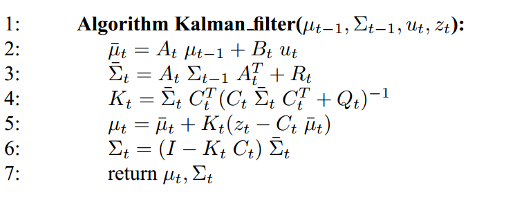
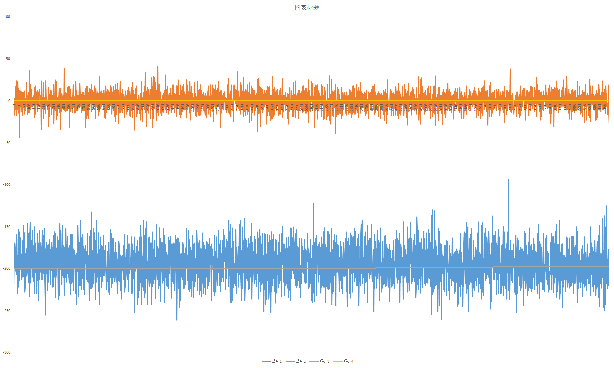

卡尔曼滤波在倒立摆中的应用
===================================
　　对于一个线性高斯系统，我们认为它内部的状态在时刻ｔ是服从于均值为ｎ维向量，
协方差为n×n维矩阵的高斯分布。而和为
系统的状态预测均值与协方差。使用(1)式描述该系统 　　　　　　　　　　　　　　　
 　　　　               　　　　　　　　　　　　　　　(1)
 其中 是系统在 t 时刻的 n 维状态描述向量，
At 是系统向下一时刻的n×n维状态转移矩阵，是m维控制向量，
Bt 是n×m维矩阵， 是系统在 t 时刻的 n 维噪声向量，
是一个高斯随机变量，所有元素均值为0，n×n维协方差矩阵为Rt 。
 ,
，
 　　使用(2)式去观测这个系统：
 　　　　　　　　　　　　　　　 　　　　　　　　　　　　　　　　　　　　           　   (2)    
 其中是k维的状态观测向量，Ct是k×n维矩阵，
 是系统在 t 时刻的 n 维观测噪声向量，
是一个高斯随机变量，所有元素均值为0，n×n维协方差矩阵为Qt 。
 ,
，
 
　　由《Probabilistic Robotics》[1]中,得到卡尔曼滤波的算法，
 　　
 　　在倒立摆模型中，可以观测到状态量是角度，角速度，接下来我们简化模型，
我们只需要去得到真实的角度和角速度，不要控制，控制姿态放到PID模型中。比如把这个倒立摆静置，然后去测量该系统的状态，
此时系统不受任何外力干扰，但是加速度计会受到机械振动的噪声干扰，陀螺仪会有零漂，温漂干扰，这些都是高斯噪声，那么怎么去描述这些
高斯噪声以求得Rt和Qt，根据《Probabilistic Robotics》[2]，可以使用更高阶的状态量去表示观测状态量，
假设这个高阶量即角加速度服从高斯分布，这个有点难理解，想象一下倒立摆静置的情况下，它的观测的角度和角速度都在不断的跳变，这是因为
角加速度是个随机量，服从高斯分布，但是均值为0。设时间间隔为T，T很短，根据你的定时器的周期为10ms，系统线性，根据高中物理公式则有：
  　　　　　　　　　　　　　　　　　　(3)
  　　(3)式对应(1)式。可得：
  　　,
  　　,
  　　,
  考虑观测模型：
  ,
  其中很难衡量，分别是角度和和角速度的零均值高斯干扰量，
对应的Qt根据实际的测量值(使用MPU6050)去选取，见build/data.txt文件，根据初中统计数据知识算到,,
 .
 由此可以建立卡尔曼算法，基于Eigen矩阵库使用C++编程可得到如下效果图，可以看到测量值跳变非常大，而中间的得到的滤波值跳变很小，黄色是角加速度值，由于只静置，所以得到的值在0附近，蓝色是加速度计测到的角度值，在-200左右。
 

