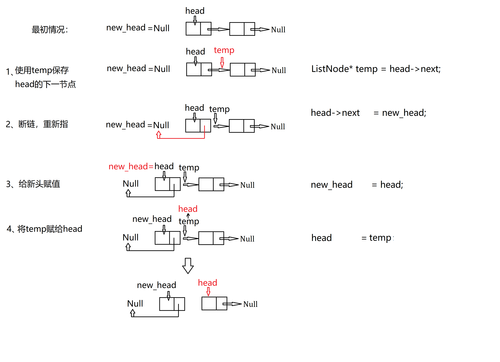

# Leetcode (40/1096)
## 一、链表
#### 1. [反转链表 206. Reverse Linked List](src/206_reverse_linked_list/reverse_linked_list.cpp)----[题目来源](https://leetcode.com/problems/reverse-linked-list/)

#### 2. [局部反转链表 92. Reverse Linked List II](src/92_reverse_linked_list_II/reverse_linked_list_II.cpp)----[题目来源](https://leetcode.com/problems/reverse-linked-list-ii/)
#### 3. [求两个链表的交点 160. Intersection of Two Linked Lists](src/160_get_intersection_node/getIntersectionNode.cpp)----[题目来源](https://leetcode.com/problems/intersection-of-two-linked-lists/description/)
#### 4. [链表求环 142. Linked List Cycle II](src/142_detectCycle/detectCycle.cpp)----[题目来源](https://leetcode.com/problems/linked-list-cycle-ii/)
#### 5. [链表划分 86. Partition List](src/86_partition_list/partition_list.cpp)----[题目来源](https://leetcode.com/problems/partition-list/description/)
#### 6. [带有随机指针链表的深度拷贝 138. Copy List with Random Pointer](src/138_copyRandomList/copyRandomList.cpp)----[题目来源](https://leetcode.com/problems/copy-list-with-random-pointer/description/)
#### 7. [两个已排序链表的合并 21. Merge Two Sorted Lists](src/21_mergeTwoLists/mergeTwoLists.cpp)----[题目来源](https://leetcode.com/problems/merge-two-sorted-lists/description/)
#### 8. [K个已排序链表的合并 23. Merge k Sorted Lists](src/23_mergeKLists/mergeKLists.cpp)----[题目来源](https://leetcode.com/problems/merge-k-sorted-lists/description/)
8

## 二、栈、队列、堆
#### 1. [使用队列实现栈 225. Implement Stack using Queues](src/225_make_stack_with_queue/stack_use_queue.cpp)----[题目来源](https://leetcode.com/problems/implement-stack-using-queues/description/)
#### 2. [简单计算器 224. Basic Calculator](src/224_basicCalculator/basic_calculator.cpp)----[题目来源](https://leetcode.com/problems/basic-calculator/description/)
#### 3. [第K大个数 215. Kth Largest Element in an Array](src/215_Kth_largest_num/kth_largest_num.cpp)----[题目来源](https://leetcode.com/problems/kth-largest-element-in-an-array/description/)
#### 4. [寻找中位数 295. Find Median from Data Stream](src/295_find_median/find_median.cpp)----[题目来源](https://leetcode.com/problems/find-median-from-data-stream/description/)
#### 5. [使用栈实现队列 232. Implement Queues using Stack](src/232_make_queue_using_stacks/queue_use_stack.cpp)----[题目来源](https://leetcode.com/problems/implement-queue-using-stacks/description/)
#### 6. [最小栈 155. Min Stack](src/155_min_stack/min_stack.cpp)----[题目来源](https://leetcode.com/problems/min-stack/description/)
14
## 三、贪心算法
#### 1. [分糖果 455. Assign Cookies](src/455_assign_cookies/assign_cookies.cpp)----[题目来源](https://leetcode.com/problems/assign-cookies/description/)
#### 2. [最长摇摆子序列 376. Wiggle Subsequence](src/376_wiggle_subsequence/wiggle_subsequence.cpp)----[题目来源](https://leetcode.com/problems/wiggle-subsequence/description/)
#### 3. [删除K个数获得最小数 402. Remove K Digits](src/402_remove_k_digits/remove_k_dig.cpp)----[题目来源](https://leetcode.com/problems/remove-k-digits/)
#### 4. [跳跃游戏I 55. Jump Game](src/55_jump_game/jump_game.cpp)----[题目来源](https://leetcode.com/problems/jump-game/description/)
#### 5. [跳跃游戏II 45. Jump GameII](src/45_jump_game_II/jump_game_II.cpp)----[题目来源](https://leetcode.com/problems/jump-game-ii/submissions/)
#### 6. [射击气球 452. Minimum Number of Arrows to Burst Balloons](src/452_burst_balloons/burst_balloons.cpp)----[题目来源](https://leetcode.com/problems/minimum-number-of-arrows-to-burst-balloons/)
20

## 四、递归、分治、回溯
#### 1. [子集 78. Subsets](src/78_subsets/subsets.cpp)----[题目来源](https://leetcode.com/problems/subsets/)(三种方法，回溯，位运算)
#### 2. [寻找波峰元素 162. Find Peak Element](src/78_subsets/subsets.cpp)----[题目来源](https://leetcode.com/problems/find-peak-element/)
#### 3. [逆序数 315. Count of Smaller Numbers After Self](src/315_count_smaller_numbers/count_smaller_numbers.cpp)----[题目来源](https://leetcode.com/problems/count-of-smaller-numbers-after-self/description/)
#### 4. [子集II 90. Subsets II](src/90_subsets_II/subsets_II.cpp)----[题目来源](https://leetcode.com/problems/subsets-ii/description/)
#### 5. [组合数之和II 40. Combination Sum II](src/40_combination_sum_II/combination_sum_II.cpp)----[题目来源](https://leetcode.com/problems/combination-sum-ii/description/)
#### 6. [生成括号 22. Generate Parentheses](src/22_generate_parentheses/generate_parentheses.cpp)----[题目来源](https://leetcode.com/problems/generate-parentheses/description/)
#### 7. [N皇后问题 51. N-Queens](src/51_N_queens/n_queens.cpp)----[题目来源](https://leetcode.com/problems/n-queens/)
27

## 五、二叉树与图
#### 1. [路径之和 113. Path Sum II](src/113_path_sum_II/path_sum_II.cpp)----[题目来源](https://leetcode.com/problems/path-sum-ii/)
#### 2. [最近公共祖先 236. Lowest Common Ancestor of a Binary Tree](src/236_lowest_commonance_ancestor/lowest_commonance_ancestor.cpp)----[题目来源](https://leetcode.com/problems/lowest-common-ancestor-of-a-binary-tree/)
#### 3. [二叉树就地转链表 114. Flatten Binary Tree to Linked List](src/114_flatten_binary_tree2linked_list/flatten_binary_tree2linked_list.cpp)----[题目来源](https://leetcode.com/problems/flatten-binary-tree-to-linked-list/description/)
#### 4. [二叉树层次遍历 广度优先  breadth-first search](src/binary_tree_breadth_first_search/binary_tree_breadth_first_search.cpp)
#### 5. [从右侧观察二叉树 199. Binary Tree Right Side View](src/199_binary_tree_right_side_view/binary_tree_right_side_view.cpp:15)----[题目来源](https://leetcode.com/problems/binary-tree-right-side-view/)
#### 6. [图的深度优先和广度优先搜索](src/graph_depth_first_search/graph_depth_first_search.cpp)
#### 7. [课程安排 207. Course Schedule  深搜和广搜两种方法，深搜因为空间限制无法AC，需改进](src/207_course_schedule/course_schedule.cpp)----[题目来源](https://leetcode.com/problems/course-schedule/)
32

## 六、二分查找与二叉查找树
#### 1. [二分查找(递归与循环)](src/binary_search/binary_search.cpp)
#### 2. [插入位置 35. Search Insert Position](src/35_search_insert_position/search_insert_position.cpp)----[题目来源](https://leetcode.com/problems/search-insert-position/)
#### 3. [区间查找 34. Find First and Last Position of Element in Sorted Array](src/34_search_range/search_range.cpp)----[题目来源](https://leetcode.com/problems/find-first-and-last-position-of-element-in-sorted-array/)
#### 4. [旋转数组查找 33. Search in Rotated Sorted Array](src/33_search_rotated_sorted_array/search_rotated_sorted_array.cpp)----[题目来源](https://leetcode.com/problems/search-in-rotated-sorted-array/description/)
#### 5. [二叉查找树编码与解码 449. Serialize and Deserialize BST](src/449_serialize_deserialize_BST/serialize_deserialize_BST.cpp)----[题目来源](https://leetcode.com/problems/serialize-and-deserialize-bst/description/)
36

## 七、哈希表与字符串
#### 1. [拉链哈希函数](src/hash/hash.cpp)
#### 2. [409. 最长回文串](src/409_longest_palindrome/longest_palindrome.cpp)----[题目来源](https://leetcode-cn.com/problems/longest-palindrome/)
#### 3. [290. 单词规律](src/290_word_pattern/word_pattern.cpp)----[题目来源](https://leetcode-cn.com/problems/word-pattern/)
#### 4. [49. 字母异位词分组](src/49_group_anagrams/group_anagrams.cpp)----[题目来源](https://leetcode-cn.com/problems/group-anagrams/)
#### 5. [3. 无重复字符的最长子串](src/3_length_longest_substring/length_longest_substring.cpp)----[题目来源](https://leetcode-cn.com/problems/longest-substring-without-repeating-characters/)

40

## 其他
#### 1. [1. 两数之和](src/1_two_sum/two_sum.cpp)----[题目来源](https://leetcode-cn.com/problems/two-sum/)时间复杂度太高
