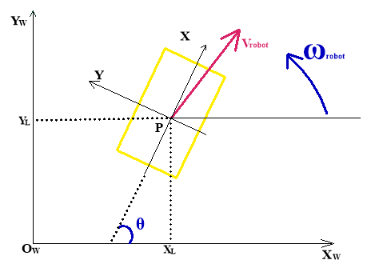

# Viusal SLAM On WUGV 介绍
                                 

## 0. 解决什么问题 
轮式无人地面交通载具(WUGV)如自动驾驶汽车，码头自动导引车，仓储运货机器人等等，都需要在无人工干预条件下自主地从
起点到达终点，称之为点镇定问题，本文介绍一种解决方法。数学定义点镇定问题：如图0.0，
世界坐标系是
，
车辆质心为O，车辆移动坐标系是
，
车辆位姿PL是
)，
给定任意位姿Pr，设计机器人速度控制输入
)，
其中e,W,K分别为位置误差，参考速度矢量和控制增益矢量，使得

=\boldsymbol{0})。

图0.0

## 1. 机器视觉对环境建模
对轮式机器人所在的环境建立世界坐标系，通过三维刚体变换可以确定轮式机器人在世界中位置。

### 1.1 相机的三维刚体变换
#### 1.1.1 相机坐标系 
本文中轮式机器人的在世界中位置原点是相机光心。以相机光心建立起的世界坐标系。轮式机器人以此来观察世界。
#### 1.1.2 坐标系的欧氏变换
当轮式机器人运动起来，相机就跟随着运动，光心坐标系也在变化，欧氏变换统一表达了坐标系之间的关系。
#### 1.1.3 李群与李代数
每一个欧氏群都是李群，而李代数建立起了李群的指数映射，更加容易使用计算机去运算。

### 1.2 非线性最小二乘方法 
使用非线性优化的方法去计算相机相邻帧之间的变换对应的李代数
#### 1.2.1 最速梯度下降法
对目标函数直接求导？？
#### 1.2.2 牛顿法 
对目标函数的导函数求导

### 1.3 图像的深度估计
当计算出相邻帧之间的变换后，可以估计出图像单个像素点的深度信息
#### 1.3.1 对极几何
使用极线搜索初始化单个像素点深度
#### 1.3.2 扩展卡尔曼滤波(EKF)
非线性高斯系统状态估计
#### 1.3.3 EKF在深度估计中的应用
使用EKF去不断更新深度

## 2. 直接法视觉里程计
视觉里程计完成了定位和建图的功能

### 2.1 位姿跟踪
对每一帧进行定位
#### 2.1.1 半稠密直接跟踪 
半稠密地图对图像中强梯度区域的进行跟踪
#### 2.1.2 非线性优化位姿
优化出SE(3)表达的位姿

### 2.2 深度滤波器 
选取关键帧构建逆深度图
#### 2.2.1 块匹配的深度初始化 
使用像素块进行极线搜索
#### 2.2.2 深度的预测
扩展卡尔曼滤波中的预测步骤
#### 2.2.3 深度的更新 
扩展卡尔曼滤波中的更新步骤

### 2.3 地图优化 
随着地图的扩大，会产生尺度漂移
#### 2.3.1 基于Sim(3)的约束搜索
优化Sim(3)表达的带尺度的位姿约束
#### 2.3.2 位姿图优化 
使用图优化算法得出关键帧(Vertex)和Sim(3)约束(Edge)的最小误差值

## 3. 轮式机器人路径规划与轨迹跟踪
基于前两章得到轮式机器人的实时定位和环境的点云地图，可以对轮式机器人实现运动控制
### 3.1 构建占有格地图
构建出用于路径规划的栅格地图

### 3.2 A*寻路算法 
寻找出轮式机器人从起点通往终点的最短全局路径

#### 3.2.1 寻路算法 
使用广度优先搜索可以寻找出从起点通往终点的路径，而Dijkstra和贪婪算法以广度优先为基础可以寻找最优路径。
A*算法实际是综合了Dijkstra和贪婪算法的评价函数，使寻路算法达到了最佳的时间复杂度。

#### 3.2.2 A*算法的优化
使用二叉堆可以加快A*算法的搜索速度

### 3.3 轨迹跟踪策略 
对轮式机器人实现运动控制
#### 3.3.1 轮式机器人运动学建模 
建立轮式机器人运动坐标系和控制模型
#### 3.3.2 局部控制策略 
使用反馈纠正机器人的运动状态，以达到点镇定目标。
