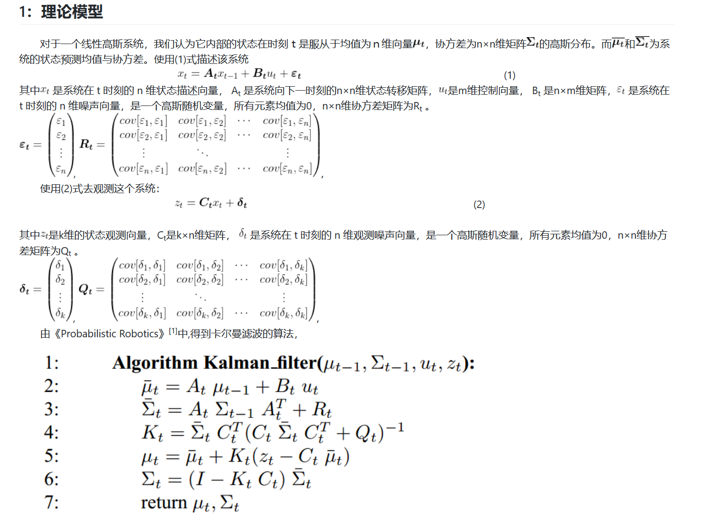
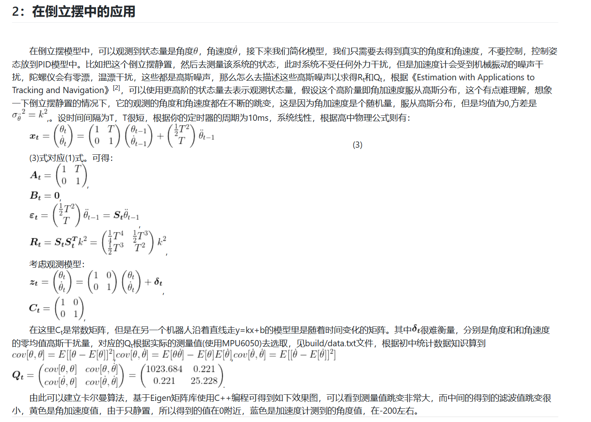
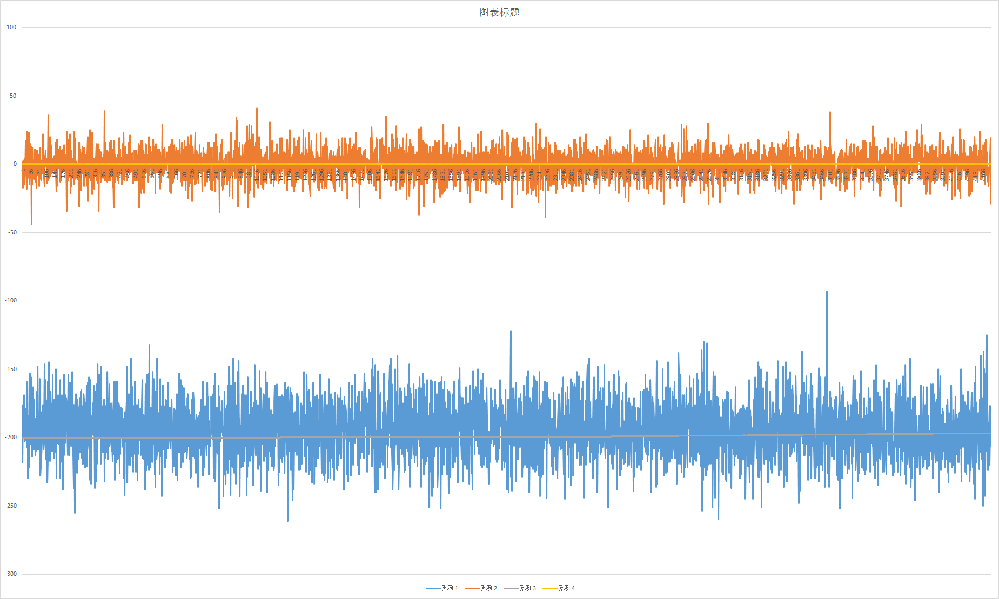
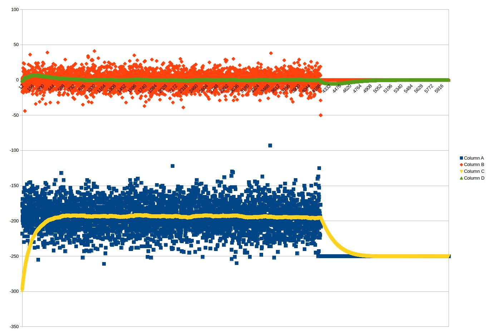

卡尔曼滤波在倒立摆中的应用
===================================
### By [Johnny Wang](https://armstrongwall.github.io/Resume/)
 
 
 
 

参考文献
-----------------------------------
[1].Sebastian Thrun,Wolfram,Burgard,Dieter Fox,Probabilistic Robotics[M],The MIT Press,2006:41-83
 [2].Yaakov Bar-Shalom,X.-Rong Li,Thiagalingam Kirubarajan,Estimation with Applications to Tracking and Navigation[M],John Wiley & Sons, Inc,2001:218-230
