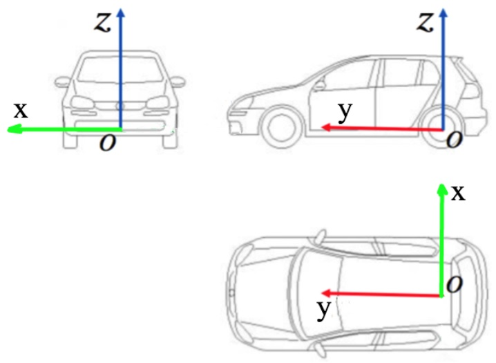

# Apollo传感器坐标系统
## 1. 车辆坐标系 – 右-前-上（Right-Forward-Up RFU）

车辆坐标系的定义为：

z轴 – 通过车顶垂直于地面指向上方

y轴 – 在行驶的方向上指向车辆前方

x轴 – 面向前方时，指向车辆右侧

车辆坐标系的原点在车辆后轮轴的中心。

## 2. GPS-IMU模块坐标系

GPS-IMU模块安装时保证坐标系与车身坐标系重合。在仿真中可把IMU的原点安装在车辆坐标系的原点。

## 3. Lidar坐标系
右手系，xyz旋转顺序，Lidar在车身坐标系下的安装的旋转角为（0°,0°,90°）。

## 4. Camera坐标系
Apollo使用了ros的tf作为坐标转换工具，安装时camera坐标系是相对于Lidar坐标系进行旋转的，
旋转角是（0°, 90°,-90°）。如果相对于车身坐标系旋转，旋转角为（-90°, 0°, 0°）

## 5. Radar坐标系
安装时radar坐标系是相对于camera坐标系进行旋转的，
旋转角是（90°，0°，90°）。如果相对于车身坐标系旋转，旋转角为（0°,0°,90°），实际与Lidar坐标系重合了。

综合如下图所示：

